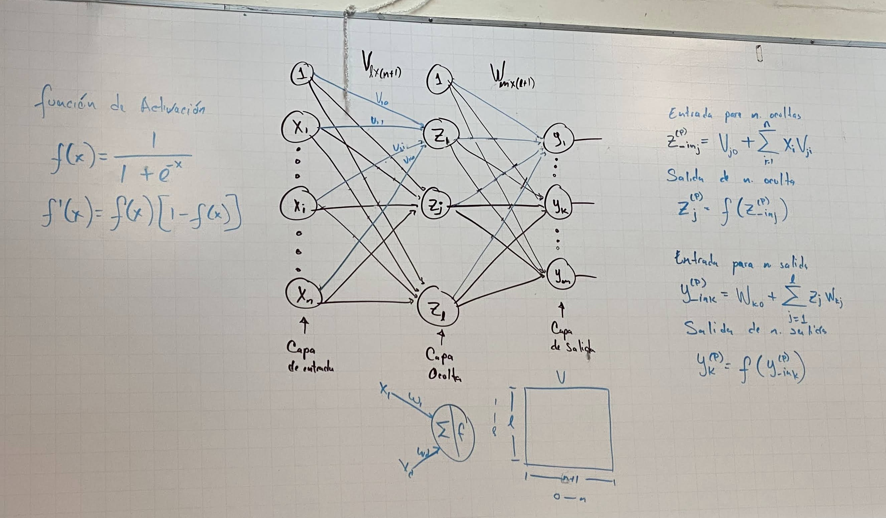
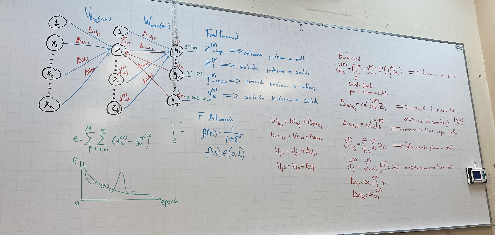

# Neural Network from scratch using Python

This project aims to consolidate and apply the concepts covered in the Artificial Intelligence class of LSIA at the University of Guanajuato, specifically in the field of Deep Learning.

Through this work, we seek to provide a deep and practical understanding of neural networks, thus facilitating learning and experimentation with advanced computational models.

You can access the Jupyter Notebook for this project [here](neural_net.ipynb).

## What is a Neural Network in Deep Learning?

A neural network in Deep Learning is a computational model inspired by the structure and functioning of the human brain.

It is composed of layers of interconnected nodes (neurons), where each layer transforms the input data by applying a series of mathematical operations.

Neural networks are capable of learning complex patterns from large volumes of data, making them ideal for tasks such as image recognition, natural language processing, and strategy games.

### Main Components of a Neural Network

1. **Input Layer**: This layer receives the input data and passes it to the next layer. Each node in this layer represents a feature or attribute of the input data.

2. **Hidden Layers**: These layers are located between the input and output layers. They perform various computations and transformations on the input data. The number of hidden layers and the number of nodes in each layer can vary depending on the complexity of the model.

3. **Output Layer**: This layer produces the final output of the network. The number of nodes in this layer corresponds to the number of possible outcomes or classes in a classification problem.

4. **Weights and Biases**: Weights are the parameters that determine the strength of the connection between nodes in different layers. Biases are additional parameters that allow the model to fit the data better by shifting the activation function.

5. **Activation Functions**: These functions introduce non-linearity into the model, enabling it to learn complex patterns. Common activation functions include ReLU (Rectified Linear Unit), Sigmoid, and Tanh.

6. **Loss Function**: This function measures the difference between the predicted output and the actual output. The goal of training a neural network is to minimize this loss.

7. **Optimizer**: This algorithm adjusts the weights and biases to minimize the loss function. Common optimizers include Gradient Descent, Adam, and RMSprop.

## Technologies Used

In this project, we will use only Python and the NumPy library to build our neural network from scratch.

Python is a versatile programming language widely used in the field of artificial intelligence, while NumPy provides support for arrays and efficient mathematical operations, essential for the development of Deep Learning models.

## Dataset Used: MNIST

In this project, we will work with the famous MNIST dataset, a collection of 70,000 images of handwritten digits.

This dataset is widely used in the Deep Learning community to train and test image recognition models.

Each image in MNIST is 28x28 pixels, making it an excellent starting point for those who want to experiment with neural networks and see quick and tangible results.
